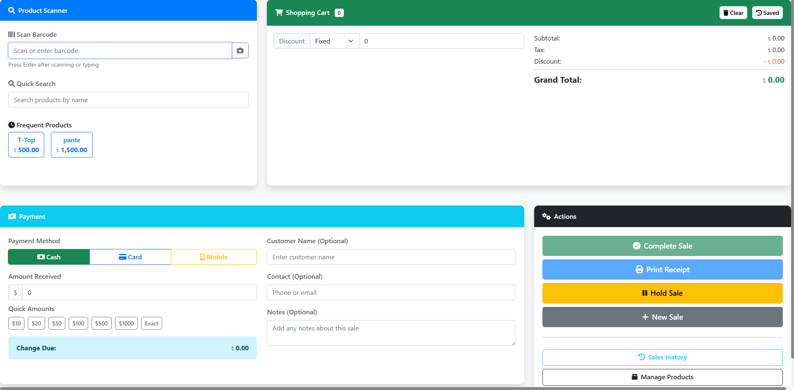
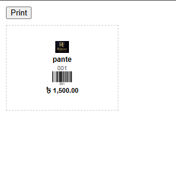
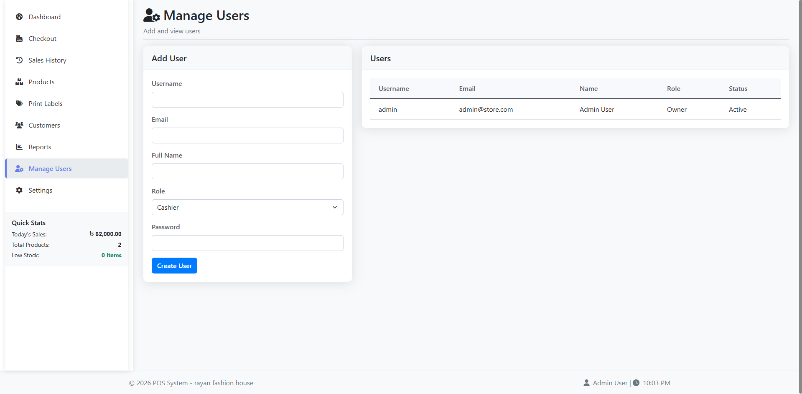

# 🧾 Web-Based POS System

A modern, lightweight, and user-friendly **Web-Based Point of Sale (POS) System** designed for small to medium businesses. Built using core web technologies with simplicity, performance, and ease of use in mind.

---

## 📸 Preview

> *(Add screenshots of your project UI here)*

```md



```

---

## 🚀 Features

* 🔐 Secure Login System (MD5 Password Hashing)
* 🛒 Product & Category Management
* 💰 Sales & Billing System
* 🧾 Auto Invoice Generation
* 👥 Customer Management
* 📊 Sales Reports
* ⚡ Fast & Lightweight UI
* 🌐 Fully Web-Based (Browser Accessible)

---

## 🛠️ Technologies Used

| Technology      | Purpose           |
| --------------- | ----------------- |
| **HTML5**       | Structure         |
| **CSS3**        | Styling & Layout  |
| **JavaScript**  | Client-side Logic |
| **PHP**         | Server-side Logic |
| **MySQL / SQL** | Database          |
| **JSON**        | Data Exchange     |
| **MD5**         | Password Hashing  |

---

## 📂 Project Structure

```bash
├── index.php                 # Redirects to dashboard
├── .htaccess                 # URL rewriting & security rules
├── README.md                 # Project documentation
├── composer.json             # PHP dependencies
├── config/
│   ├── database.php          # Database configuration
│   ├── constants.php         # Global constants
│   └── email.php             # Email configuration
├── auth/
│   ├── login.php             # User login
│   ├── register.php          # User registration (optional)
│   └── logout.php            # Logout handler
├── dashboard/
│   ├── index.php             # Main dashboard
│   ├── products/             # Product management
│   │   ├── add.php
│   │   ├── manage.php
│   │   ├── edit.php
│   │   ├── delete.php
│   │   ├── import.php
│   │   └── export.php
│   ├── sales/                # Sales & billing
│   │   ├── checkout.php
│   │   ├── history.php
│   │   ├── receipt.php
│   │   ├── refund.php
│   │   └── export.php
│   ├── labels/               # Product label printing
│   │   ├── print-labels.php
│   │   ├── preview-label.php
│   │   └── generate-label.php
│   └── reports/              # Reports & analytics
│       ├── dashboard.php
│       ├── sales-report.php
│       ├── inventory-report.php
│       └── export.php
├── api/                      # AJAX / API endpoints
│   ├── products/
│   │   ├── find.php
│   │   ├── search.php
│   │   ├── frequent.php
│   │   └── update-stock.php
│   ├── sales/
│   │   ├── create.php
│   │   ├── list.php
│   │   ├── get.php
│   │   └── refund.php
│   └── cart/
│       ├── save.php
│       └── load.php
├── includes/                 # Core helpers
│   ├── header.php
│   ├── footer.php
│   ├── db_connect.php
│   ├── functions.php
│   ├── auth.php
│   └── validation.php
├── assets/
│   ├── css/                  # Stylesheets
│   ├── js/                   # JavaScript files
│   ├── uploads/              # Uploaded files
│   │   ├── logos/
│   │   ├── products/
│   │   └── temp/
│   └── images/               # Static images
│       ├── logo.png
│       └── favicon.ico
├── vendors/                  # Third‑party libraries
│   ├── html2pdf/
│   ├── phpexcel/
│   └── barcode-generator/
├── temp/                     # Session & cache
├── logs/                     # Error logs
└── backups/                  # Database backups
```

---

## ⚙️ Installation Guide

### 1️⃣ Requirements

* XAMPP / WAMP / LAMP
* PHP 7.x or higher
* MySQL
* Web Browser (Chrome recommended)

### 2️⃣ Setup Steps

1. Clone the repository

```bash
git clone https://github.com/salahuddin-saif/Web-Based-Pos-System.git
```

2. Move project to server directory

```bash
htdocs/web-based-pos-system
```

3. Create database

* Open **phpMyAdmin**
* Create a database (e.g. `pos_db`)
* Import `database.sql`

4. Configure database

Edit:

```php
config/database.php
```

5. Run the project

```
http://localhost/web-based-pos-system
```

---

## 🔐 Default Login (Optional)

```
Username: admin
Password: admin123
```

> *(Password stored using MD5 hash)*

---

## 📸 Screenshot Section (Recommended)

Create a folder named **screenshots/** and add images:

```md







```

---

## 🧠 Security Notes

* MD5 hashing is used for passwords (educational purpose)
* For production, consider **bcrypt / password_hash()**

---

## 📌 Future Improvements

* Role-based access control
* Barcode scanner support
* PDF invoice export
* REST API integration
* Better password hashing

---

## 🤝 Contributing

Contributions are welcome!

1. Fork the repository
2. Create a new branch
3. Commit changes
4. Open a Pull Request

---

## 📄 License

This project is licensed under the **MIT License**.

---

## 👨‍💻 Author

**SALAHUDDIN**
💼 Full‑Stack Web Developer
🌐 PHP | Web | POS Systems

---

⭐ If you like this project, don’t forget to **star the repo**!
